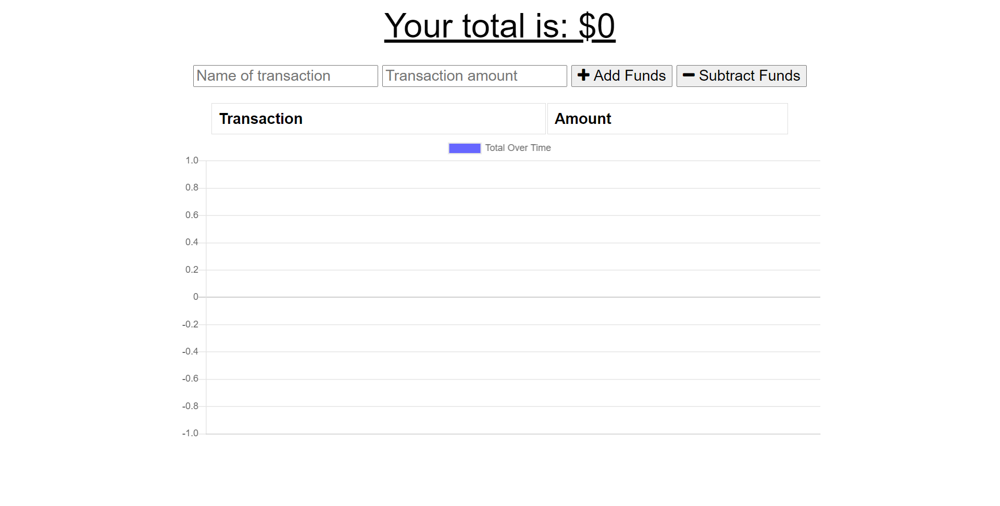

 # Budget Tracker
  

## Description

I want to be able to track my withdrawals and deposits with or without a data/internet connection
so that my account balance is accurate when I am traveling.

## Table of Contents

* [installation](#installation)
* [usage](#usage)
* [license](#license)
* [contributing](#contributing)
* [test](#tests)
* [questions](#questions)

To install necessary dependencies run the following command

npm install

## Usage
The user inputs a withdrawal or deposit then that will be shown on the page, and added to their transaction history when their connection is back online.

## License
      
This project is licensed under the MIT license.

## Contributing

N/A

## Tests
To run test run the following command:
'''
npm test
'''

## Deployed site
[Deployed site](https://budget-tracker-ct.herokuapp.com/) 

## Screenshots of application

### Main Page

## Questions
If you have any questions about the repo contact me directly at c.trahan94@yahoo.com.
You can find more of my work at my  [GitHub](https://github.com/ctrahan94) page.

